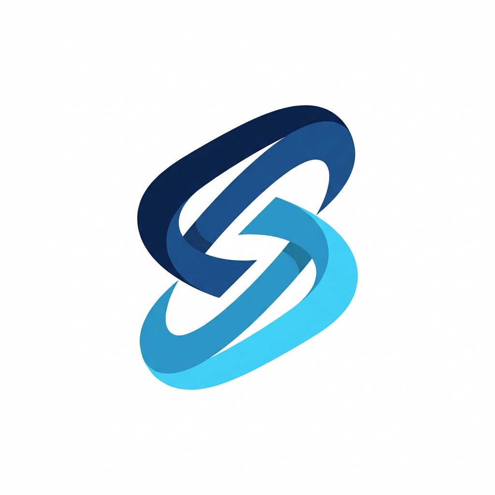

# NEXO

<p align="center">
  English | <a href="./README.pt-BR.md">Português (Brasil)</a>
</p>

<p align="center">
  
</p>

<p align="center">
  <strong>Markdown -> corporate PDF automation for developer documentation workflows.</strong>
</p>

<p align="center">
  NEXO turns Markdown documentation into polished, shareable PDFs through a web UI and API, so engineering teams can ship stakeholder-ready docs without manual formatting.
</p>

<p align="center">
  
  
  
  
  
</p>


NEXO is an open-source developer tool for teams that already write docs in Markdown but need a cleaner output for leadership updates, release approvals, client reports, architecture reviews, and compliance handoffs.

## Early Access

The free converter is live for validation and early feedback.

- Try the product locally with the web UI or API examples in this repository
- Try the hosted product at [nexo.speck-solutions.com.br](https://nexo.speck-solutions.com.br/)
- Join the early-access waitlist at [nexo.speck-solutions.com.br/pricing](https://nexo.speck-solutions.com.br/pricing)
- Use the waitlist to validate interest before investing in paid acquisition or broader launch work

## Why NEXO

Markdown is great for authoring, versioning, and collaborating. It is usually not great for the final handoff.

NEXO closes that gap by converting Markdown into corporate-ready PDFs with:

- browser-based PDF rendering via Playwright
- multi-document conversion in a single request
- optional image attachments as appendix pages
- custom logo support for branded output
- a simple web UI and a scriptable API
- a dedicated CLI repository for batch conversion via the hosted API

## Workflow

```text
Markdown docs / release notes / ADRs / reports
                    |
                    v
                  NEXO
      parse + style + paginate + brand
                    |
                    v
       Corporate-ready PDF for sharing
```

Typical use cases:

- release summaries for approval flows
- ADRs and architecture reviews
- client-facing delivery reports
- incident summaries with evidence attachments
- compliance and audit documentation exports

## Quick Example

Write Markdown:

```md
# Release Summary

## Highlights
- Added SSO support
- Reduced API latency by 32%
- Closed 14 production bugs

## Risks
- Rollback playbook still needs final review

## Next Steps
1. Validate the staging checklist
2. Share the PDF with stakeholders
```

Generate a PDF with the API:

```bash
curl -X POST http://localhost:3000/api/free/convert \
  -H "Content-Type: application/json" \
  --data @examples/payload.json \
  --output release-summary.pdf
```

The resulting PDF is paginated for A4 output and ready to share outside GitHub or your internal docs stack.

## CLI

NEXO also has a dedicated CLI repository for command-line and batch workflows:

- Repository: [github.com/DaviSpeck/nexo-cli](https://github.com/DaviSpeck/nexo-cli)
- Guide in this repo: [CLI.md](./CLI.md)

Install globally:

```bash
npm install -g nexo-md-to-pdf-cli
```

Run conversions:

```bash
nexo release-summary.md
nexo a.md b.md --output-dir ./pdfs
```

The CLI uses the hosted NEXO API, so rendering, free-mode limits, and Supabase usage counting remain centralized in the main product. In this first CLI version, attachments stay out of scope on purpose.

## API Usage

Health check:

```bash
curl http://localhost:3000/api/health
```

Conversion request:

```bash
curl -X POST http://localhost:3000/api/free/convert \
  -H "Content-Type: application/json" \
  -d '{
    "documents": [
      {
        "fileName": "release-summary.md",
        "markdown": "# Release Summary\n\n## Highlights\n- Added SSO support\n- Reduced API latency by 32%\n- Closed 14 production bugs",
        "attachments": []
      }
    ],
    "customLogo": {
      "fileName": "brand-mark.png",
      "mimeType": "image/png",
      "dataUrl": "data:image/png;base64,<your-base64-logo>",
      "tone": "light"
    }
  }' \
  --output release-summary-branded.pdf
```

Current free API limits:

- up to 3 Markdown documents per request
- up to 120,000 characters per document
- up to 180,000 characters total
- up to 4 attachments per document
- up to 8 attachments total
- up to 4 MB per attachment
- up to 16 MB total attachment size
- optional custom logo up to 2 MB
- accepted attachments: `png`, `jpeg`, `webp`
- accepted logo formats: `png`, `jpeg`, `webp`, `svg`

## Local Setup

Prerequisites:

- Node.js 22+
- Yarn 1.x
- Playwright Chromium

Install and run:

```bash
yarn install
yarn playwright install chromium
yarn dev
```

Open [http://localhost:3000](http://localhost:3000).

Useful commands:

```bash
yarn typecheck
yarn build
```

## Generate Your First PDF

1. Start the app with `yarn dev`.
2. Open the web UI at `http://localhost:3000`.
3. Upload `examples/release-summary.md` or paste Markdown content.
4. Optionally add image attachments or a custom logo.
5. Generate the PDF from the UI, or call the API with `examples/payload.json`.

## Project Structure

```text
app/                  Next.js app router pages and API routes
components/           UI components
lib/                  PDF generation, limits, and shared services
examples/             sample Markdown and API payloads
public/               static brand assets and demo media
supabase/             SQL migrations for waitlist and event logs
```

## Features

- Markdown to PDF conversion through a web UI and API
- Playwright-based rendering for browser-quality output
- Multi-document conversion in a single request
- Attachment appendix pages for screenshots and evidence
- Optional custom logo branding in generated PDFs
- A4-friendly PDF layout for stakeholder sharing
- Waitlist capture and product-interest flow with Supabase
- Usage-event logging for the free converter and web flows
- CI example for generating PDF artifacts from docs

## Release Status

`v0.1 - NEXO Free` currently focuses on the free converter experience:

- unauthenticated Markdown to PDF conversion
- browser upload workflow
- API-first conversion path for local automation
- dedicated CLI repository for hosted conversion from terminal workflows
- branding and attachment support
- waitlist capture and event logging
- CI example for repeatable PDF export

## GitHub Launch Ready

For PASSO 1 of public validation, this repository now has:

- a clear positioning statement near the top
- the demo GIF visible in the opening section
- a concrete API example and local setup path
- sample files in `examples/`
- a live website at [nexo.speck-solutions.com.br](https://nexo.speck-solutions.com.br/)
- waitlist support implemented in the product via [the pricing page](https://nexo.speck-solutions.com.br/pricing) and `/api/waitlist`

Before publishing the repo, set the GitHub repository description to:

`Markdown -> corporate PDF automation for developer documentation workflows.`

## Roadmap

- [x] Markdown-to-PDF conversion
- [x] Multi-document conversion
- [x] Attachment appendix support
- [x] Custom logo branding
- [x] Web UI and API for local use
- [x] Waitlist and event logging integration
- [x] CI example for automated PDF export
- [ ] Richer Markdown rendering for tables and code blocks
- [ ] Reusable themes and output templates
- [x] Dedicated CLI repository for CI and local automation
- [ ] GitHub-native workflows for docs repositories
- [ ] Hosted NEXO Pro collaboration and governance features

## Contributing

Contributions are welcome, especially around:

- Markdown rendering fidelity
- PDF layout quality
- API ergonomics
- CI and GitHub automation examples
- docs, onboarding, and sample workflows

See [CONTRIBUTING.md](./CONTRIBUTING.md) for local setup and contribution guidance.

## License

This repository is licensed under the [MIT License](./LICENSE).
